# Metrics
## [CloudifySource/cloudify](https://github.com/CloudifySource/cloudify)
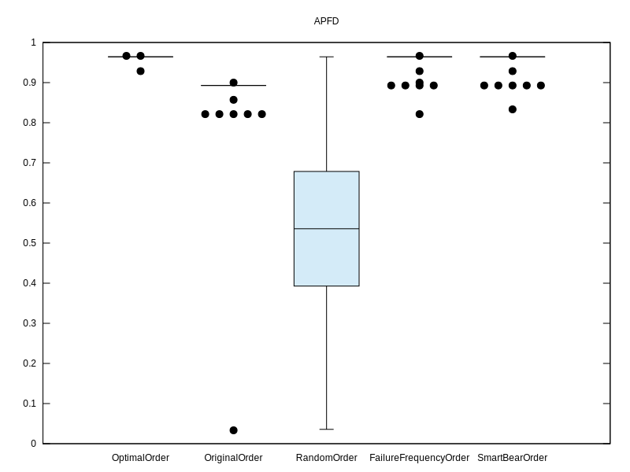

## [DSpace/DSpace](https://github.com/DSpace/DSpace)
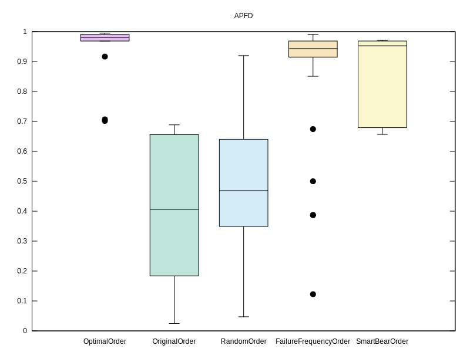

## [Graylog2/graylog2-server](https://github.com/Graylog2/graylog2-server)
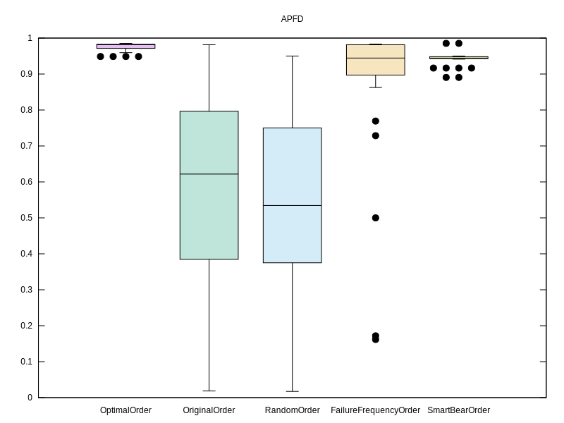

## [SonarSource/sonarqube](https://github.com/SonarSource/sonarqube)

## [adamfisk/LittleProxy](https://github.com/adamfisk/LittleProxy)
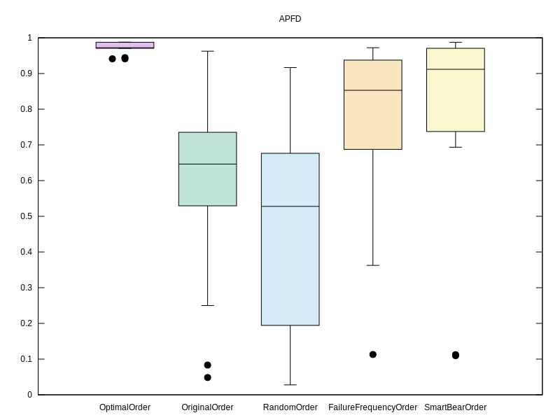

## [apache/sling](https://github.com/apache/sling)
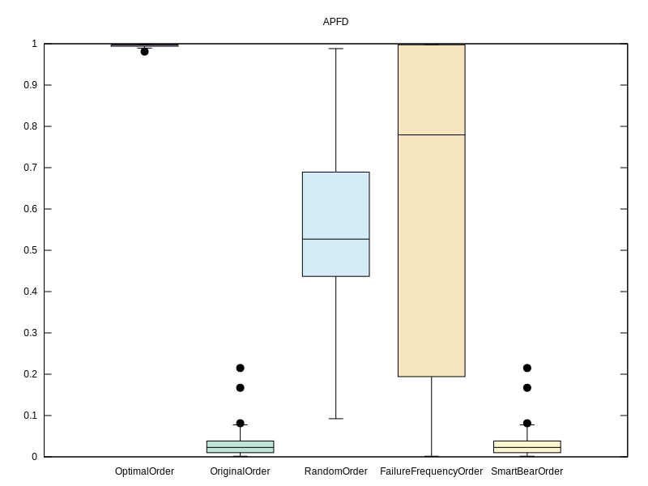

## [brettwooldridge/HikariCP](https://github.com/brettwooldridge/HikariCP)
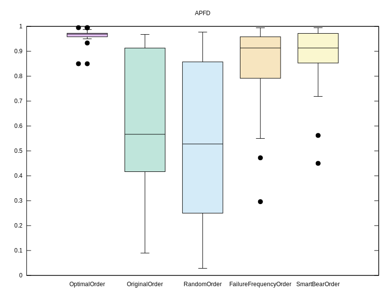

## [deeplearning4j/deeplearning4j](https://github.com/deeplearning4j/deeplearning4j)
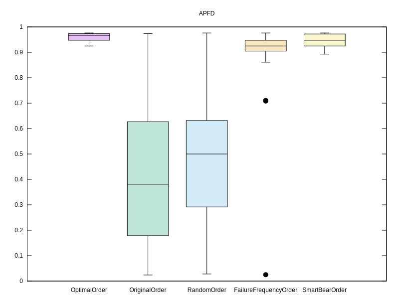

## [doanduyhai/Achilles](https://github.com/doanduyhai/Achilles)
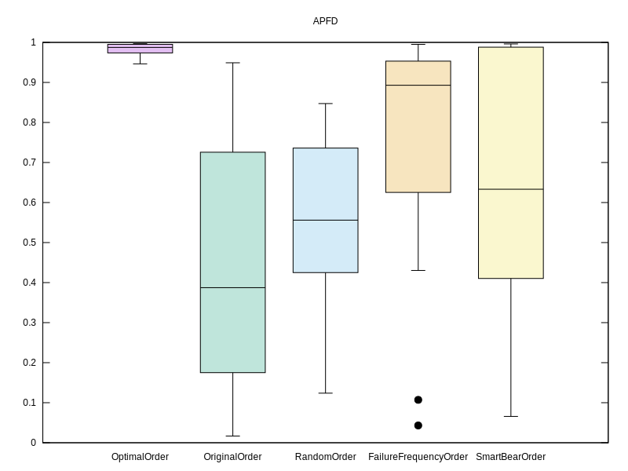

## [dynjs/dynjs](https://github.com/dynjs/dynjs)
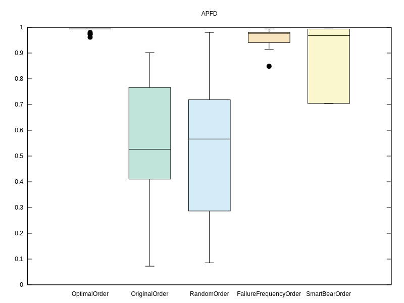

## [eclipse/jetty.project](https://github.com/eclipse/jetty.project)
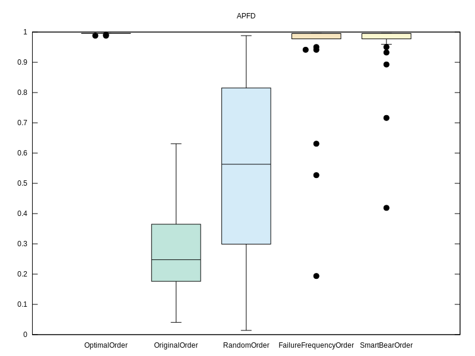

## [jOOQ/jOOQ](https://github.com/jOOQ/jOOQ)
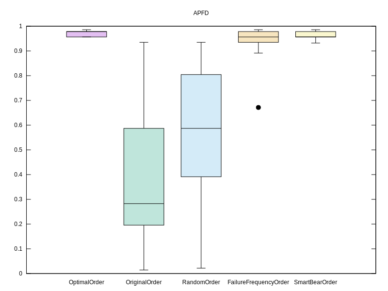

## [jcabi/jcabi-github](https://github.com/jcabi/jcabi-github)
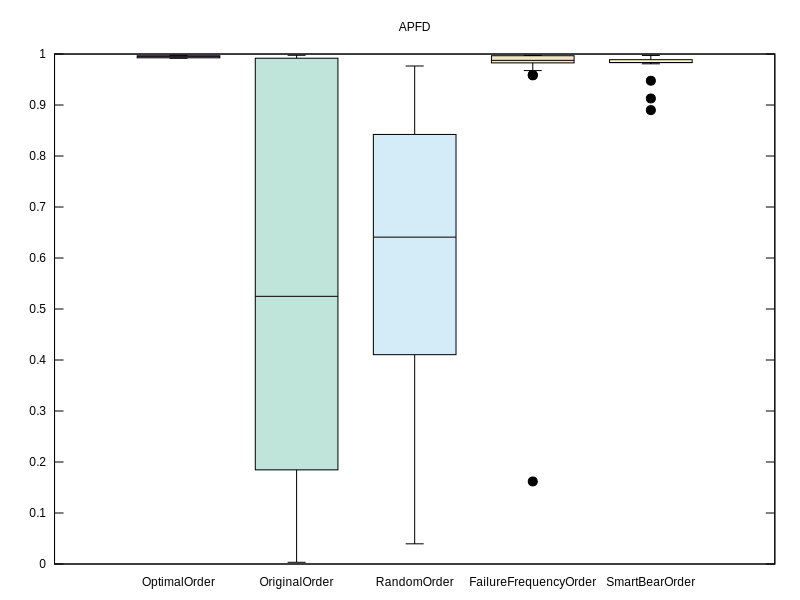

## [jsprit/jsprit](https://github.com/jsprit/jsprit)
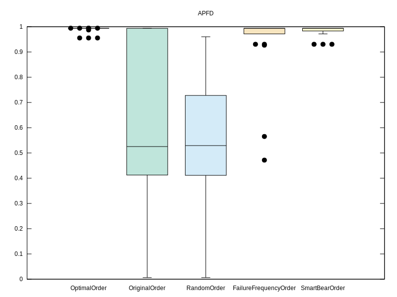

## [julianhyde/optiq](https://github.com/julianhyde/optiq)
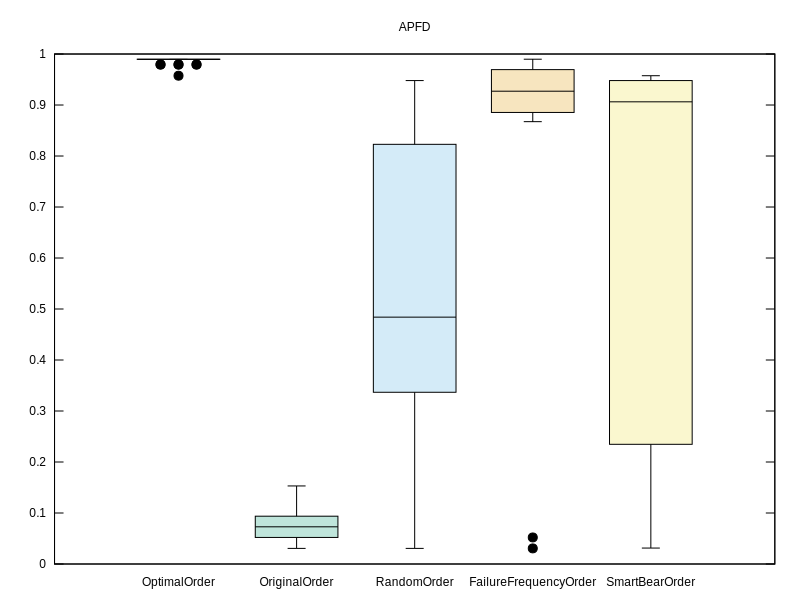

## [l0rdn1kk0n/wicket-bootstrap](https://github.com/l0rdn1kk0n/wicket-bootstrap)
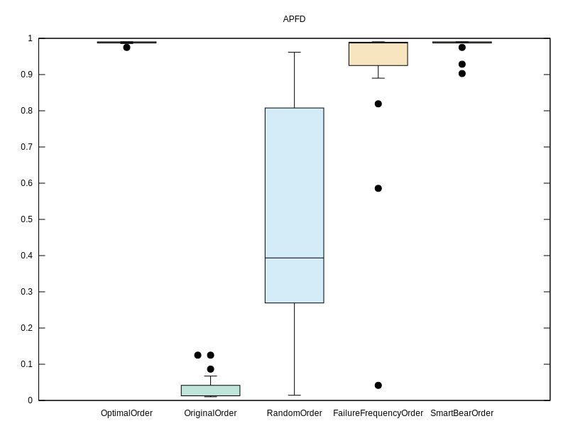

## [neuland/jade4j](https://github.com/neuland/jade4j)
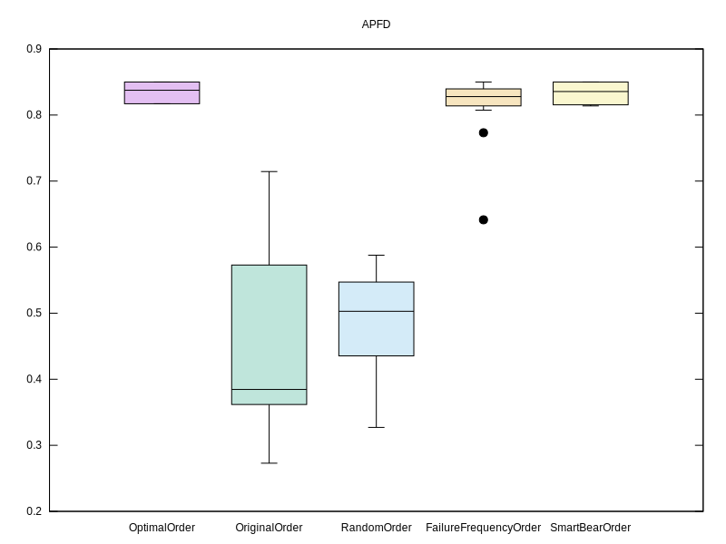

## [square/okhttp](https://github.com/square/okhttp)

## [thinkaurelius/titan](https://github.com/thinkaurelius/titan)

